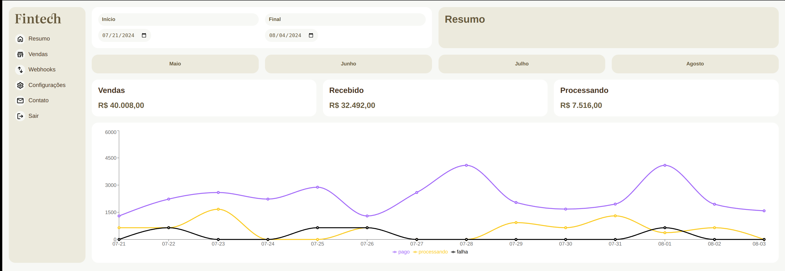

# fintech project

The fintech project is a basic dashboard that displays a sales summary over a period of time. I created this project to improve my skills with TypeScript and React.

### Setup and Running

Clone this project to your computer, navigate to the fintech folder, and run the command **npm install** to fetch the dependencies. After that, run **npm run dev** to start the server.

### Main page

